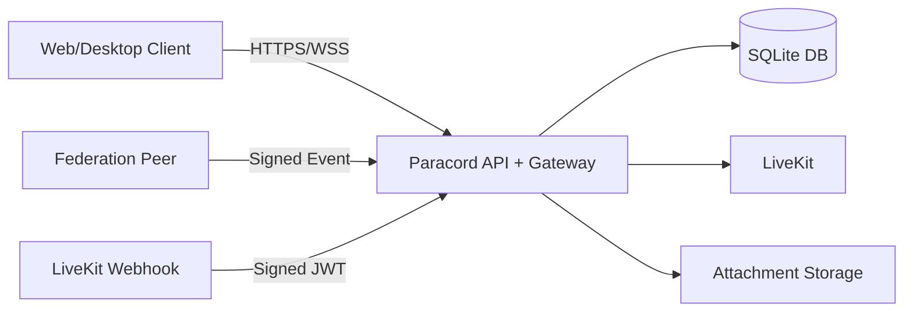

# Paracord Threat Model

## Assets
- User auth credentials and session tokens
- Message/attachment confidentiality and integrity
- Moderation actions and authorization boundaries
- Server signing keys and TLS private keys

## Trust Boundaries
- Internet client -> API/gateway boundary
- API -> database boundary
- API -> LiveKit boundary
- Desktop renderer -> local OS storage boundary

## High-Risk Attack Paths
1. Transport downgrade / certificate abuse
2. Unauthenticated webhook or federation event injection
3. Permission bypass in WS opcodes and moderation routes
4. Attachment-based active content execution (stored XSS)
5. Abuse amplification via permissive CORS or spoofed rate-limit identity

## Security Invariants
- No high-impact state mutation without authenticated identity.
- All state mutations enforce space/channel authorization checks.
- Untrusted content never executes in Paracord origin context.
- Public transport defaults to HTTPS/WSS with redirect + HSTS.
- Security-sensitive events are auditable.

## Data Flow (High Level)

